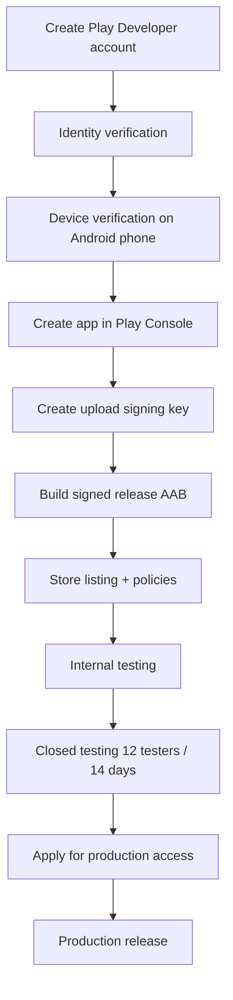

# Saúde Pilates — Android (Native Kotlin)

Native Jetpack Compose app mirroring the web and iOS application features, connected to the same Firebase project (`saudepilates-170df`).

**Package name:** `com.saudepilates.app`  
**Current version:** `1.1.0` (versionCode `2`)

---

## Requirements

- **Android Studio Ladybug (2024.2.1)** or newer
- **JDK 17**
- Android 8.0+ device or emulator (API 26+)
- Firebase Android app registered in [Firebase Console](https://console.firebase.google.com/)

---

## Setup

### 1. Register Android app in Firebase (required)

The app shows a setup screen until Firebase is configured with a valid app ID.

1. Open [Firebase Console → saudepilates-170df](https://console.firebase.google.com/project/saudepilates-170df/settings/general)
2. Click **Add app** → **Android**
3. Package name: `com.saudepilates.app`
4. Download `google-services.json`
5. Save it as `android/app/google-services.json` (this file is **gitignored** — never commit it)
6. In Android Studio: **Build → Clean Project**, then **Build → Rebuild Project**, then run

> First-time clone: `cp app/google-services.json.example app/google-services.json`, then replace with the file from Firebase Console.  
> If the file is missing or still has placeholders, the app shows setup instructions instead of crashing.

**Security:** If API keys were ever committed, rotate them in Google Cloud Console. See [docs/FIREBASE-SECRETS.md](../docs/FIREBASE-SECRETS.md).

### 2. Configure Android SDK

**With Android Studio (recommended):** Open the `android/` folder in Android Studio — it creates `local.properties` automatically.

**Command line only:** Install the SDK and point Gradle at it:

```bash
brew install --cask android-commandlinetools
export ANDROID_HOME=/opt/homebrew/share/android-commandlinetools
yes | sdkmanager --licenses
sdkmanager "platform-tools" "platforms;android-35" "build-tools;35.0.0"
```

Create `android/local.properties` (gitignored):

```properties
sdk.dir=/opt/homebrew/share/android-commandlinetools
```

On Intel Macs, the Homebrew path may be `/usr/local/share/android-commandlinetools`.

### 3. Build and run

```bash
cd android
./gradlew assembleDebug
```

Or open in Android Studio and press **Run**.

**Getting a fresh build on the emulator/device:**

1. **File → Sync Project with Gradle Files**
2. **Build → Clean Project**
3. **Build → Rebuild Project**
4. Uninstall the old app on the device (`adb uninstall com.saudepilates.app`)
5. **Run** again

The login screen shows `v{version}` from `BuildConfig.VERSION_NAME` to confirm the new APK is installed.

### 4. Install on device/emulator

```bash
./gradlew installDebug
```

Debug APK: `app/build/outputs/apk/debug/app-debug.apk`

---

## Google Play Store

Publishing checklist for **Saúde Pilates** on Google Play. Personal developer accounts have extra steps (device verification + closed testing).

### Overview



---

### Step 1 — Create Play Developer account ✅ (if already paid $25)

1. Go to [Google Play Console](https://play.google.com/console)
2. Sign in with the Google account that will **own** the developer account
3. Pay the **one-time $25** registration fee
4. Accept the **Developer Distribution Agreement**
5. Choose account type:
   - **Personal** — individual developer (current flow below)
   - **Organization** — company with D-U-N-S number

> Use the same Google account everywhere (Play Console web, Play Console mobile app, payments). Only the **account owner** can complete verification.

---

### Step 2 — Identity verification

Play Console will ask for identity details on the **Home** page.

**Personal accounts** typically need:

- Legal name and address (from linked Google Payments profile)
- **Government-issued ID** (photo upload)
- Phone number verification

Complete every task on the Home page until identity verification is approved. This can take a few days.

References:

- [Verify your developer identity](https://support.google.com/googleplay/android-developer/answer/10841920)
- [Get started with Play Console](https://support.google.com/googleplay/android-developer/answer/6112435)

---

### Step 3 — Device verification on a physical Android phone 👈 **YOU ARE HERE**

Personal accounts must prove access to a **real Android device** using the **Google Play Console** mobile app before publishing.

**Device requirements:**

- Physical phone (emulator does **not** work)
- Android **10+**
- **Not rooted**

**Steps:**

1. On your **computer**, open [Play Console](https://play.google.com/console) and sign in as the **account owner**
2. Go to **Home**
3. Find the task **“Verify that you have access to an Android mobile device”**
4. Click **View details**
5. On your **Android phone**, scan the **QR code** shown on the web page  
   - Installs/opens the [Google Play Console app](https://play.google.com/store/apps/details?id=com.google.android.apps.playconsole)
6. In the Play Console app, sign in with the **same Google account** used to create the developer account
7. Select your developer account
8. Tap **Verify** and follow on-screen instructions
9. Return to Play Console on the web — the device verification task should disappear from **Home**

**Troubleshooting:**

| Problem | Fix |
|---------|-----|
| Verification task still shows | Sign out/in on the phone app; confirm same Google account as web |
| Wrong account on phone | Hamburger menu → switch account → add the developer Gmail |
| No Android phone | Borrow one temporarily; verification is a one-time requirement |
| Emulator | Not supported for this step |

Reference: [Device verification requirements](https://support.google.com/googleplay/android-developer/answer/14316361)

---

### Step 4 — Create the app in Play Console

After device verification:

1. Play Console → **All apps** → **Create app**
2. Fill in:
   - **App name:** Saúde Pilates
   - **Default language:** Portuguese (Brazil)
   - **App or game:** App
   - **Free or paid:** Free (or Paid, if you change pricing later)
3. Accept declarations (Play policies, US export laws, etc.)
4. Click **Create app**

**Important:** Package name must be **`com.saudepilates.app`** — it must match `applicationId` in `app/build.gradle.kts` and your Firebase Android app. You cannot change the package name after the first production release.

---

### Step 5 — Create the upload signing key

Google Play uses **Play App Signing**. You create an **upload key**; Google holds the app signing key.

On your Mac, generate a keystore (run once, **back up the file and passwords**):

```bash
keytool -genkey -v \
  -keystore ~/saudepilates-upload-key.jks \
  -keyalg RSA -keysize 2048 -validity 10000 \
  -alias saudepilates-upload
```

Create `android/keystore.properties` (gitignored — do not commit):

```properties
storeFile=/Users/evertonbuzzi/saudepilates-upload-key.jks
storePassword=YOUR_STORE_PASSWORD
keyAlias=saudepilates-upload
keyPassword=YOUR_KEY_PASSWORD
```

Wire signing in `app/build.gradle.kts` (not configured yet in the repo — add when ready):

```kotlin
val keystorePropertiesFile = rootProject.file("keystore.properties")
val keystoreProperties = java.util.Properties()
if (keystorePropertiesFile.exists()) {
    keystoreProperties.load(keystorePropertiesFile.inputStream())
}

android {
    signingConfigs {
        create("release") {
            if (keystorePropertiesFile.exists()) {
                storeFile = file(keystoreProperties["storeFile"] as String)
                storePassword = keystoreProperties["storePassword"] as String
                keyAlias = keystoreProperties["keyAlias"] as String
                keyPassword = keystoreProperties["keyPassword"] as String
            }
        }
    }
    buildTypes {
        release {
            signingConfig = signingConfigs.getByName("release")
            // ...
        }
    }
}
```

Add to repo `.gitignore`:

```
android/keystore.properties
*.jks
```

**Firebase (release builds):** After creating the keystore, add release **SHA-1** and **SHA-256** to Firebase:

```bash
keytool -list -v -keystore ~/saudepilates-upload-key.jks -alias saudepilates-upload
```

Firebase Console → Project settings → Your Android app → **Add fingerprint**.

---

### Step 6 — Build the release bundle (AAB)

Google Play requires an **Android App Bundle** (`.aab`), not a debug APK.

```bash
cd android
./gradlew bundleRelease
```

Output: `app/build/outputs/bundle/release/app-release.aab`

**Android Studio:** **Build → Generate Signed App Bundle or APK** → **Android App Bundle** → **release**.

Before each upload, bump version in `app/build.gradle.kts`:

```kotlin
versionCode = 3        // must increase every upload
versionName = "1.2.0"  // user-visible version
```

---

### Step 7 — Store listing and compliance

In Play Console, complete all required sections before release:

| Section | What to provide |
|---------|-----------------|
| **Main store listing** | Short + full description (PT-BR), 512×512 icon, feature graphic 1024×500, ≥2 phone screenshots |
| **Privacy policy** | `https://saudepilates.com.br/privacy` |
| **App content → Data safety** | Email auth, user/company data, payments, health/anamnesis data |
| **App content → Content rating** | Complete IARC questionnaire |
| **Target audience** | Likely 18+ (business app) |
| **Ads** | No, if the app has no ads |
| **Contact email** | e.g. `saudepilatess@gmail.com` |

---

### Step 8 — Internal testing (recommended first upload)

1. **Testing → Internal testing** → **Create new release**
2. Upload `app-release.aab`
3. Add release notes
4. Add testers (your Gmail)
5. Copy the **opt-in link** and install from Play Store on your phone

This validates signing, Firebase, and install flow before wider testing.

---

### Step 9 — Closed testing (required for personal accounts)

Personal accounts created after **Nov 13, 2023** must run a **closed test** before production:

- **Minimum 12 testers** opted in
- **14 consecutive days** of opted-in testers

1. Finish app setup in Play Console
2. **Testing → Closed testing** → create release → upload AAB
3. Add testers (email list or Google Group)
4. Share the opt-in link; testers install from Play Store
5. Wait **14 days** with ≥12 testers continuously opted in

Reference: [App testing requirements for personal accounts](https://support.google.com/googleplay/android-developer/answer/14151465)

---

### Step 10 — Apply for production access

When closed testing criteria are met:

1. Play Console → **Dashboard**
2. Click **Apply for production**
3. Answer questions about testing, app value, and production readiness
4. Wait for Google review (often ~7 days)

After approval, **Production** track unlocks.

---

### Step 11 — Production release

1. **Test and release → Production** → **Create new release**
2. Upload AAB (or promote from closed testing)
3. Submit for review
4. After approval, the app goes live on Google Play

---

### Android developer verification (2026+)

Google is rolling out **package name registration** for verified developers. Apps distributed via Play Console are typically auto-registered when you create the app. If prompted:

- Play Console → **Android developer verification** → **Package names**
- Package: `com.saudepilates.app`

Reference: [Android developer verification](https://developer.android.com/developer-verification)

---

## Feature parity

### Authentication

- Login / Register company (admin)
- Role-based routing: Admin, Professor, Student

### Admin

| Feature | Screen |
|---------|--------|
| Dashboard stats (active students) | Início |
| Students list, create, edit, payment history + delete | Pessoas → Alunos |
| Professors list | Pessoas → Professores |
| Plans list | Pessoas → Planos |
| Register payment (with commission) | Pagamentos → Registrar |
| Monthly payments + delete | Pagamentos → Mês |
| Professor commissions | Pagamentos → Professores |
| Schedule | Mais → Agenda |
| Anamnesis | Mais → Anamnese |
| Company settings | Mais → Configurações |

### Professor

| Feature | Screen |
|---------|--------|
| Dashboard | Início |
| My students | Alunos |
| Schedule | Agenda |
| Earnings history | Mais → Ganhos |
| Attendance | Mais → Presença |
| Student evolution | Mais → Evolução |
| Messages | Mais → Mensagens |
| Anamnesis | Mais → Anamnese |

### Student

| Feature | Screen |
|---------|--------|
| Dashboard (plan, next class) | Início |
| Payment history | Pagamentos |
| Schedule | Agenda |

---

## Project structure

```
android/
├── app/
│   ├── google-services.json      # Firebase config (replace from console)
│   └── src/main/kotlin/com/saudepilates/app/
│       ├── data/models/          # Shared data models
│       ├── data/repositories/    # Firebase Auth + Firestore
│       ├── ui/admin/             # Admin screens
│       ├── ui/professor/         # Professor screens
│       ├── ui/student/           # Student screens
│       ├── ui/auth/              # Login / Register
│       └── ui/navigation/        # Role-based bottom navigation
├── build.gradle.kts
└── settings.gradle.kts
```

---

## Shared Firebase collections

Same as web/iOS: `users`, `companies`, `plans`, `studentPayments`, `professorPayments`, `professorPayouts`, `scheduledClasses`, `attendanceRecords`, `evolutions`, `anamnesis`, `messages`, `subscriptions`.

---

## Notes

- Admin user creation uses a secondary Firebase Auth instance so the admin session stays active (same pattern as iOS).
- Deleting a student payment cascades to the linked professor commission record.
- Professor commission list only shows payments linked to existing student payments.
- Version label on login/dashboard reads from `BuildConfig.VERSION_NAME`.
