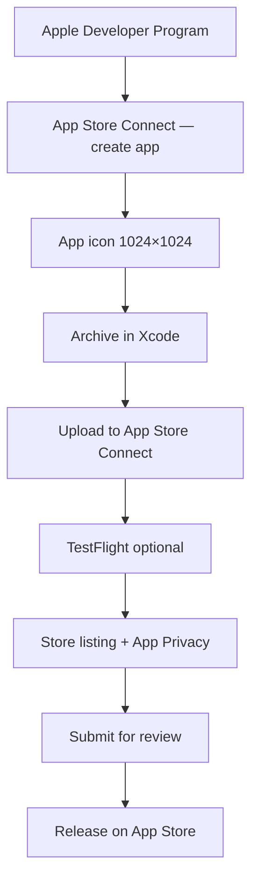

# Saúde Pilates — iOS (Native Swift)

Native SwiftUI app mirroring the web and Android application features, connected to the same Firebase project (`saudepilates-170df`).

**Bundle ID:** `com.saudepilates.app`  
**Current version:** `1.1.0` (build `3`)

---

## Requirements

- macOS with **Xcode 15+**
- iOS 16+ device or simulator
- Firebase iOS app registered in [Firebase Console](https://console.firebase.google.com/)
- [Apple Developer Program](https://developer.apple.com/programs/) membership ($99/year) — required for App Store

---

## Setup

### 1. Register iOS app in Firebase (required)

The app will show a setup screen until Firebase is configured.

1. Open [Firebase Console → saudepilates-170df](https://console.firebase.google.com/project/saudepilates-170df/settings/general)
2. Click **Add app** → **iOS**
3. Bundle ID: `com.saudepilates.app`
4. Download `GoogleService-Info.plist`
5. Save it as `ios/SaudePilates/GoogleService-Info.plist` (this file is **gitignored** — never commit it)
6. In Xcode: **Product → Clean Build Folder**, then run again

> First-time clone: `cp SaudePilates/GoogleService-Info.plist.example SaudePilates/GoogleService-Info.plist`, then replace with the file from Firebase Console.  
> If the plist is missing or still has placeholders, the app shows setup instructions instead of crashing.

**Security:** If API keys were ever committed, rotate them in Google Cloud Console. See [docs/FIREBASE-SECRETS.md](../docs/FIREBASE-SECRETS.md).

### 2. Generate Xcode project

```bash
cd ios
xcodegen generate
open SaudePilates.xcodeproj
```

Re-run `xcodegen generate` after editing `project.yml` (versions, team ID, dependencies).

### 3. Configure signing

In Xcode → Target **SaudePilates** → **Signing & Capabilities**:

- Enable **Automatically manage signing**
- Select your **Team** (Apple Developer account)
- Ensure Bundle Identifier is `com.saudepilates.app`

Team ID is stored in `project.yml` (`DEVELOPMENT_TEAM`). Update it if you use a different Apple account:

```yaml
DEVELOPMENT_TEAM: "YOUR_TEAM_ID"
```

Find Team ID in Xcode → **Settings → Accounts** → select your team → **Team ID**.

### 4. Run

Select an iPhone simulator or device and press **Run** (⌘R).

The login screen and admin dashboard show `v{version}` from `AppVersion.swift` (reads `MARKETING_VERSION` in `project.yml`).

### 5. Bump version before each App Store upload

Edit `ios/project.yml`:

```yaml
MARKETING_VERSION: "1.2.0"   # user-visible (App Store version)
CURRENT_PROJECT_VERSION: "3" # build number — must increase every upload
```

Then regenerate and archive:

```bash
cd ios
xcodegen generate
```

---

## App Store

Step-by-step guide to publish **Saúde Pilates** on the Apple App Store.

### Overview



---

### Step 1 — Enroll in Apple Developer Program

1. Go to [developer.apple.com/programs](https://developer.apple.com/programs/)
2. Enroll with your Apple ID (individual or organization)
3. Pay **$99/year**
4. Wait for approval (usually 24–48 hours, sometimes longer)

You need an active membership before you can distribute to TestFlight or the App Store.

---

### Step 2 — Create the app in App Store Connect

1. Open [App Store Connect](https://appstoreconnect.apple.com)
2. **Apps** → **+** → **New App**
3. Fill in:
   - **Platforms:** iOS
   - **Name:** Saúde Pilates
   - **Primary language:** Portuguese (Brazil)
   - **Bundle ID:** `com.saudepilates.app` (must exist in [Certificates, Identifiers & Profiles](https://developer.apple.com/account/resources/identifiers/list) — Xcode automatic signing creates it on first archive)
   - **SKU:** e.g. `saudepilates-ios` (internal reference, cannot change later)
   - **User access:** Full access (unless you use a team with limited roles)

---

### Step 3 — Add app icon (required before submission)

The app icon is **`Assets.xcassets/AppIcon.appiconset/AppIcon-1024.png`** — generated from the web logo `src/assets/lotus-160.png` (lotus + pilates figure on black background).

To replace it: add a new **1024×1024 PNG** (no transparency) and update `AppIcon.appiconset/Contents.json` if the filename changes.

---

### Step 4 — Archive the app in Xcode (detailed guide)

Archiving creates a **Release** build of your app that you upload to Apple. This section assumes you have never used Xcode before.

#### What is an Archive?

- A **snapshot** of your app compiled for real iPhones (not the simulator)
- Stored on your Mac in **Organizer**
- Uploaded to **App Store Connect** → becomes a **TestFlight** / **App Store** build

You cannot upload a Debug build or a simulator build to the App Store. **Archive** is the required path.

---

#### Before you start — checklist

| Requirement | Your project |
|-------------|--------------|
| Mac with Xcode installed | Required |
| Apple Developer Program active ($99/year) | Required |
| App created in App Store Connect | You already did this |
| App icon 1024×1024 in Assets → AppIcon | Done |
| Signed in to Xcode with your Apple ID | See below |
| Physical iPhone | **Not required** for archive (only for later TestFlight testing) |

---

#### Part A — Open the project correctly

1. Open **Finder** → go to `saudepilates/ios/`
2. Double-click **`SaudePilates.xcodeproj`** (blue Xcode icon)
3. Wait for Xcode to finish **Indexing** and **Resolving Package Dependencies** (Firebase) — watch the top status bar. Do not archive until this finishes.

> Always open the **`.xcodeproj`** inside `ios/`, not the repo root.

---

#### Part B — Sign in with your Apple Developer account

1. Xcode menu bar → **Xcode → Settings…** (or **Preferences** on older Xcode)
2. Tab **Accounts**
3. Click **+** (bottom left) → **Apple ID** → sign in with the same Apple ID used for App Store Connect
4. Select your account → you should see your **Team** (Developer Program team name)
5. Close Settings

---

#### Part C — Verify signing (one-time)

1. In the **left sidebar** (Project Navigator), click the **blue project icon** at the top named **SaudePilates**
2. In the center panel, under **TARGETS**, select **SaudePilates** (not the PROJECT row)
3. Open the **Signing & Capabilities** tab
4. Ensure:
   - **Automatically manage signing** is **checked**
   - **Team** is your developer team (not "None")
   - **Bundle Identifier** is `com.saudepilates.app`
   - No red error under signing

If you see a red error:

- **"No accounts"** → complete Part B
- **"Failed to register bundle identifier"** → the ID may already exist; try building once on a connected iPhone, or fix in [developer.apple.com](https://developer.apple.com/account/resources/identifiers/list)
- **"Provisioning profile"** errors → toggle **Automatically manage signing** off and on again

---

#### Part D — Select the correct run destination (critical)

At the **top center** of Xcode, next to the scheme **SaudePilates**, there is a device dropdown.

1. Click the device dropdown (it might say "iPhone 15 Simulator" or a device name)
2. Choose **Any iOS Device (arm64)**

```
✅ Correct:   Any iOS Device (arm64)
❌ Wrong:     iPhone 15 Simulator (or any Simulator)
❌ Wrong:     My Mac (Designed for iPad)
```

**Why:** **Product → Archive** is **disabled** (grayed out) when a Simulator is selected. You must pick **Any iOS Device (arm64)**.

If **Archive** is still grayed out:

- Wait for indexing to finish
- Menu **Product → Clean Build Folder** (⇧⌘K), then try again
- Confirm scheme is **SaudePilates** (not a test target)

---

#### Part E — Build for Release (optional but recommended first time)

Before archiving, confirm the project compiles:

1. **Product → Build** (⌘B)
2. Wait for **Build Succeeded** in the status bar (top right)

If build fails, read the **red errors** in the left **Issue Navigator** (⚠️ icon in sidebar). Fix those before archiving.

---

#### Part F — Create the Archive

1. Confirm destination is still **Any iOS Device (arm64)**
2. Menu **Product → Archive**
3. Xcode compiles in **Release** mode — this can take **1–5 minutes** the first time
4. When finished, the **Organizer** window opens automatically

If Organizer does not open: **Window → Organizer** (or ⇧⌘O in some versions)

---

#### Part G — Organizer window

Organizer shows a list of **Archives** for SaudePilates.

Each row shows:

- **Version** (e.g. 1.1.0)
- **Build** (e.g. 2)
- **Date** archived

Select your newest archive (today’s date).

---

#### Part H — Upload to App Store Connect

1. Click **Distribute App** (blue button, right side)
2. **Destination:** select **App Store Connect** → **Next**
3. **Distribution method:** select **Upload** → **Next**
   - (Do not choose Export unless you need a local `.ipa` file)
4. **App Store Connect distribution options** — keep defaults:
   - ✅ Upload your app’s symbols (recommended for crash reports)
   - ✅ Manage version and build number (usually leave checked)
   - → **Next**
5. **Re-sign / signing:** keep **Automatically manage signing** → **Next**
6. Review the summary → **Upload**
7. Wait for upload progress bar to complete (minutes, depends on internet)
8. You should see **Upload Successful** → **Done**

Apple will email you when processing finishes (often **5–30 minutes**, sometimes longer).

---

#### Part I — After upload — App Store Connect

1. Open [appstoreconnect.apple.com](https://appstoreconnect.apple.com)
2. **Apps** → **Saúde Pilates**
3. **TestFlight** tab → your build appears when status is **Ready to Submit** (not "Processing")
4. If build is missing after 1 hour, check email for processing errors

Common processing failures:

- Missing app icon → you already added AppIcon-1024
- Invalid bundle ID → must be `com.saudepilates.app`
- Compliance missing → answer export compliance in App Store Connect

**Export compliance:** `Info.plist` sets `ITSAppUsesNonExemptEncryption` to `false`. When App Store Connect asks about encryption, answer **No** / standard HTTPS only.

---

#### Part J — Install via TestFlight (after build processes)

1. App Store Connect → **TestFlight** → **Internal Testing**
2. Add yourself as internal tester (your Apple ID email)
3. On your iPhone, install **TestFlight** from the App Store
4. Open the invite email or TestFlight app → install **Saúde Pilates**

---

#### Xcode UI map (quick reference)

```
┌─────────────────────────────────────────────────────────────┐
│  Xcode menu:  Product → Archive                             │
├──────────────┬──────────────────────────────┬───────────────┤
│  Navigator   │  Editor (code / settings)    │  Inspectors   │
│  (left)      │  (center)                    │  (right)      │
│              │                              │               │
│  SaudePilates│  Signing & Capabilities      │               │
│   ├ Assets   │  Team: [your team]           │               │
│   ├ Views    │  Bundle ID: com.saudepilates │               │
│   └ ...      │                              │               │
├──────────────┴──────────────────────────────┴───────────────┤
│  Top bar:  [SaudePilates ▾]  [Any iOS Device (arm64) ▾]    │
└─────────────────────────────────────────────────────────────┘
```

---

#### Troubleshooting archive & upload

| Problem | Solution |
|---------|----------|
| **Archive** menu is grayed out | Select **Any iOS Device (arm64)**, not Simulator |
| Build fails on Firebase packages | **File → Packages → Reset Package Caches**, then Build |
| "No signing certificate" | Settings → Accounts → Download Manual Profiles; check Team |
| Upload fails "authentication" | Re-login in Xcode → Settings → Accounts |
| "Redundant binary" | Bump `CURRENT_PROJECT_VERSION` in `project.yml`, run `xcodegen generate`, archive again |
| Organizer empty after Archive | **Window → Organizer**; filter by SaudePilates |
| Wrong version uploaded | Edit `project.yml` → `xcodegen generate` → archive again |
| **Xcode Cloud / GitHub "Grant Access" error** | You do **not** need Xcode Cloud to publish. See below |

#### GitHub modal appears when you Archive (common)

**Product → Archive** may finish successfully, then Xcode immediately opens **"Grant Access to Your Source Code"** for Firebase/Google Swift packages. This is **not** caused by your monorepo (web + android + ios in one repo is fine).

The modal is an optional Apple/Xcode Cloud step. Click **Cancel** — your archive is usually already saved in **Organizer**.

**Bypass the modal entirely — use Terminal:**

```bash
cd ios
./scripts/archive-and-export.sh
```

This creates `ios/build/export/SaudePilates.ipa` with no GitHub dialog. Upload that file with **[Transporter](https://apps.apple.com/app/transporter/id1450874784)**.

#### Xcode Cloud / GitHub permission error (during Upload)

During upload, Xcode may show **"Grant Access to Your Source Code"** for Firebase/Google packages. If you see:

> *Connecting Xcode Cloud with your source control provider was incomplete…*

This is about **Xcode Cloud** (Apple’s CI service), **not** a requirement for App Store upload. You can ignore Xcode Cloud entirely.

**Workaround A — Export + Transporter (recommended)**

1. In **Organizer** → **Distribute App**
2. If the GitHub dialog appears → click **Cancel**
3. Try again: **Distribute App** → **App Store Connect** → choose **Export** (not Upload) → save the `.ipa` to Desktop
4. On Mac, install **[Transporter](https://apps.apple.com/app/transporter/id1450874784)** (free from Mac App Store)
5. Open Transporter → drag the `.ipa` file → **Deliver**

**Workaround B — Command line export**

After a successful **Product → Archive**:

```bash
cd ios
xcodegen generate

xcodebuild -exportArchive \
  -archivePath ~/Library/Developer/Xcode/Archives/$(date +%Y-%m-%d)/SaudePilates*.xcarchive \
  -exportPath build/export \
  -exportOptionsPlist ExportOptions.plist
```

Then upload `build/export/SaudePilates.ipa` with **Transporter**.

> Tip: In Organizer, right-click your archive → **Show in Finder** to get the exact `.xcarchive` path.

**If you actually want to fix GitHub access (optional)**

Only needed for **Xcode Cloud CI**, not for manual upload:

1. GitHub → **Settings** → **Applications** → **Installed GitHub Apps** → **Xcode Cloud** → **Configure**
2. Under **Repository access**, ensure your `saudepilates` repo is selected
3. If the repo is under a **GitHub Organization**, an org admin must approve the Xcode Cloud app
4. In Xcode → **Settings → Accounts**, add your **GitHub** account (separate from Apple ID)

#### Bump version before a new upload

Edit `ios/project.yml`:

```yaml
MARKETING_VERSION: "1.1.0"   # user-visible version
CURRENT_PROJECT_VERSION: "2" # increment for every upload (3, 4, 5…)
```

Then:

```bash
cd ios
xcodegen generate
```

Re-open Xcode and archive again.

---

#### Command line (optional, advanced)

```bash
cd ios
xcodegen generate
xcodebuild -scheme SaudePilates \
  -destination 'generic/platform=iOS' \
  -configuration Release \
  archive -archivePath build/SaudePilates.xcarchive
```

Then upload via Xcode **Organizer** or the Mac [Transporter](https://apps.apple.com/app/transporter/id1450874784) app.

---

### Step 5 — TestFlight (recommended before public release)

1. App Store Connect → your app → **TestFlight**
2. When the build finishes processing, it appears under **iOS builds**
3. Complete **Test Information** if asked (what to test)
4. **Internal testing:** add yourself (up to 100 team members) — no review required
5. Install **TestFlight** on your iPhone → accept invite → install build
6. Verify login, Firebase, and main flows on a real device

External TestFlight (public beta link) requires a short Beta App Review.

---

### Step 6 — Store listing and compliance

In App Store Connect → **App Store** tab, complete:

| Section | What to provide |
|---------|-----------------|
| **Screenshots** | 6.7" and 6.5" iPhone sizes (or use Xcode simulator screenshots); iPad if supporting tablet |
| **Description** | Short + full description in Portuguese |
| **Keywords** | pilates, gestão, academia, alunos, pagamentos |
| **Support URL** | `https://saudepilates.com.br` |
| **Privacy policy URL** | `https://saudepilates.com.br/privacy` |
| **Category** | Business or Health & Fitness |
| **Age rating** | Complete questionnaire (likely 4+ / no mature content) |
| **App Privacy** | Declare data collected — see below |
| **Pricing** | Free (or set price) |

#### App Privacy (nutrition labels)

Declare data your app handles via Firebase:

| Data type | Collected | Linked to user | Purpose |
|-----------|-----------|----------------|---------|
| Email address | Yes | Yes | Account / authentication |
| Name | Yes | Yes | Account / app functionality |
| Health & fitness (anamnesis) | Yes | Yes | App functionality |
| Payment info (records, not card numbers) | Yes | Yes | App functionality |

Firebase SDK privacy manifests are included via Swift Package Manager. You still complete the questionnaire in App Store Connect based on **your** app's behavior.

#### Review notes (optional but helpful)

In **App Review Information**, add demo credentials if Apple needs to log in:

```
Admin test account (or explain that reviewers must register a company).
Backend: Firebase (saudepilates-170df).
```

---

### Step 7 — Submit for review

1. App Store Connect → **App Store** → **+ Version** (e.g. `1.1.0`)
2. Select the uploaded build
3. Answer **Export Compliance**, **Content Rights**, **Advertising Identifier** (No, if no ads/tracking)
4. Click **Add for Review** → **Submit to App Review**

Review typically takes **24–48 hours** (can be longer).

---

### Step 8 — Release

After approval:

- **Manually release this version**, or
- **Automatically release** after approval

The app appears on the App Store under **Saúde Pilates**.

---

### Future updates

1. Bump `MARKETING_VERSION` and `CURRENT_PROJECT_VERSION` in `project.yml`
2. `xcodegen generate`
3. **Product → Archive** → upload new build
4. Create new App Store version → select build → submit

`CURRENT_PROJECT_VERSION` (build number) **must increase** for every upload, even if marketing version stays the same.

---

## Feature parity

### Authentication

- Login / Register company (admin)
- Role-based routing: Admin, Professor, Student
- Subscription gate for admin (trial / expiration check)

### Admin

| Feature | Screen |
|---------|--------|
| Dashboard stats | Admin Dashboard |
| Students CRUD, deactivate/reactivate | Students |
| Student payment history + delete | Tap student |
| Professors CRUD, deactivate/reactivate | Professors |
| Plans management | Plans |
| Register payment | Payment Registration |
| Monthly payments + delete | Monthly Payments |
| Payment charts | Visualization |
| Professor commissions + mark paid | Professor Payments |
| Schedule management | Agenda |
| Anamnesis | Anamnese |
| Company settings | Configurações |
| Subscription info | Assinatura |

### Professor

| Feature | Screen |
|---------|--------|
| Dashboard | Início |
| My students | Alunos |
| Schedule | Agenda |
| Earnings history | Ganhos |
| Attendance control | Presença |
| Student evolution | Evolução |
| Messages | Mensagens |
| Anamnesis | Anamnese |

### Student

| Feature | Screen |
|---------|--------|
| Dashboard | Início |
| Payment history | Pagamentos |
| Upcoming classes | Agenda |

---

## Architecture

```
ios/SaudePilates/
├── Models/          # Data types matching Firestore
├── Services/        # Firebase Auth + Firestore operations
├── Utilities/       # Currency, dates, toasts, AppVersion
├── Views/
│   ├── Auth/        # Login, Register
│   ├── Admin/       # All admin screens
│   ├── Professor/   # Professor screens
│   ├── Student/     # Student screens
│   └── Shared/      # Toast, loading, dialogs
└── SaudePilatesApp.swift
```

---

## Firestore collections used

- `users`, `companies`, `plans`
- `studentPayments`, `professorPayments`, `professorPayouts`
- `scheduledClasses`, `attendanceRecords`, `evolutions`
- `anamnesis`, `messages`, `subscriptions`

---

## Notes

- Payment delete cascades to linked professor commission (same logic as web)
- Professor payments list shows only active commissions linked to existing student payments
- Admin "Total Students" counts active students only
- Stripe subscription payment opens web portal link (native Stripe can be added later)
- Version label on login/dashboard reads from `MARKETING_VERSION` in `project.yml`

---

## Troubleshooting

**Firebase Auth error on register user (admin creating student/professor):**  
Ensure Email/Password auth is enabled in Firebase Console.

**Missing GoogleService-Info.plist / invalid GOOGLE_APP_ID:**  
Download the real plist from Firebase Console for your iOS app.

**Build fails resolving Firebase packages:**  
Xcode → File → Packages → Reset Package Caches, then build again.

**Archive fails — signing errors:**  
Confirm Team is selected, Bundle ID is `com.saudepilates.app`, and your Developer Program membership is active.

**Upload succeeds but build missing in App Store Connect:**  
Wait for email “Processing complete”; check **Activity** tab for errors (often missing icon or invalid entitlements).

**Export compliance email from Apple:**  
`ITSAppUsesNonExemptEncryption` is already `false` in `Info.plist` for standard HTTPS/Firebase usage.

---

See the root [README.md](../README.md) for the full multi-platform overview and Android Play Store guide.
